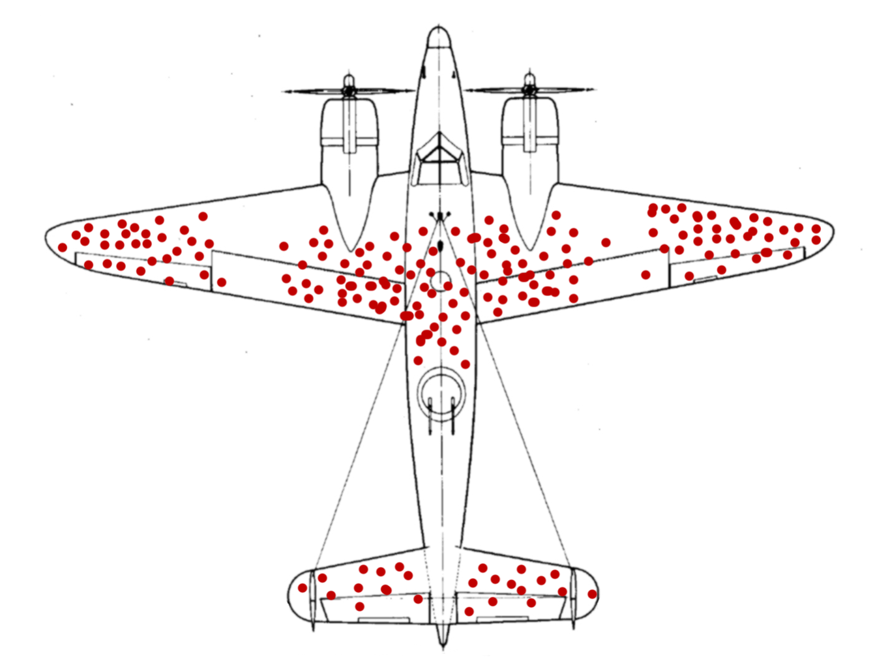
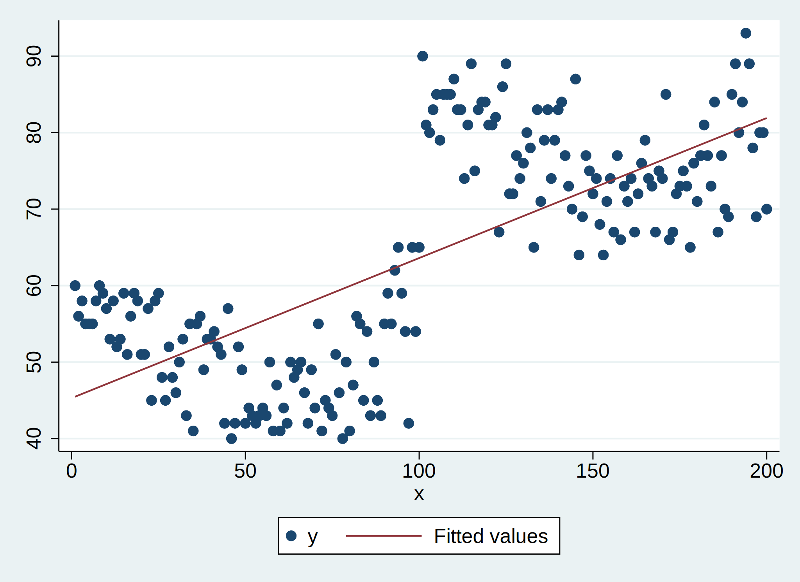
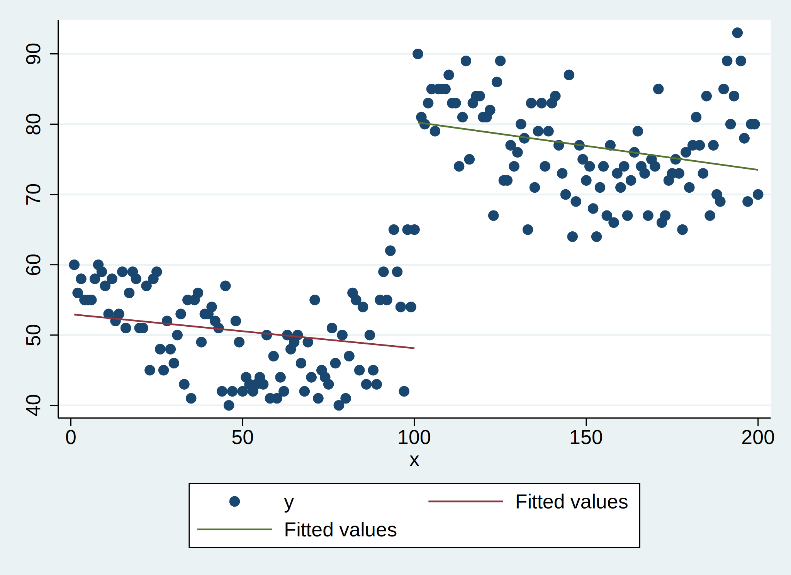
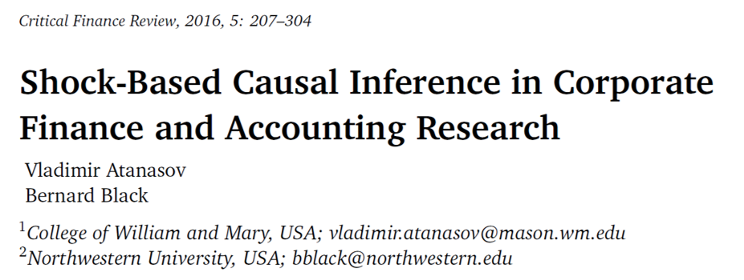
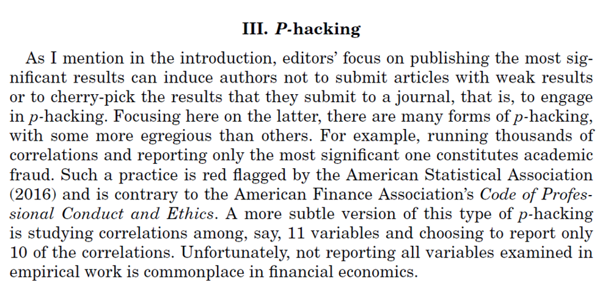
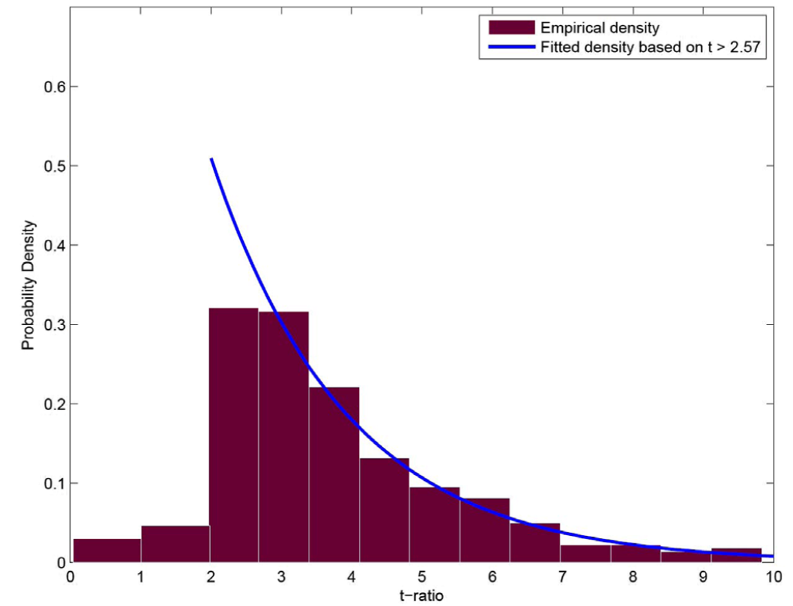
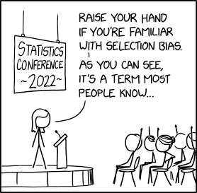
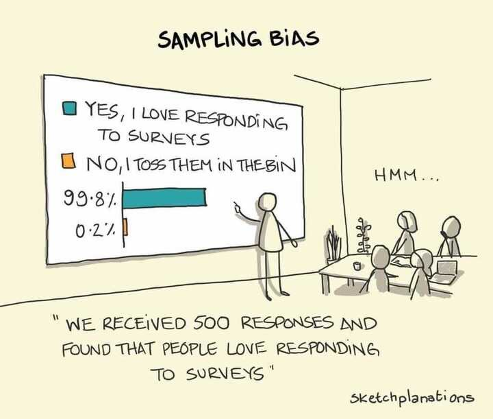
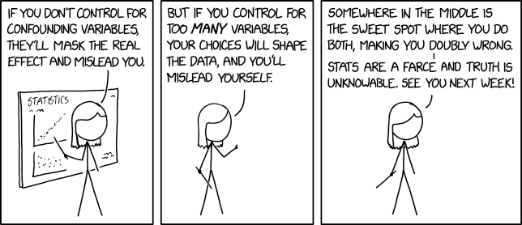
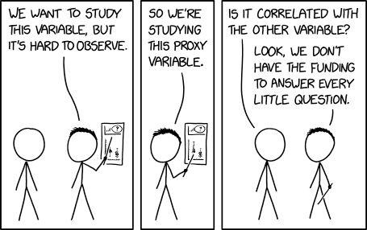

# Agenda

## Agenda {.smaller}

- Apresentação do syllabus do curso
  - Apresentação dos critérios de avaliação
  
. . .

- Breve apresentação dos temas de pesquisa e discussão inicial sobre a entrega final

. . .

- Início do conteúdo
  - Introdução a causalidade


## Sobre a letter  {.smaller visibility="hidden"}

- Formato letter
  - Entre 2k e 2.5k palavras a depender do journal.
  
*The objective of a letter is to facilitate the rapid dissemination of important research that contains an insight, new data, or discuss current important topic.*
  
- Irá requerer todas as etapas da pesquisa (com ênfase na análise dos dados, i.e., regressões).

- Idealmente, será submetida com o/a orientador/a. Leia-se, sua missão é "convencer" de que o trabalho final é submetível a uma revista. 


## Sobre a letter  {.smaller visibility="hidden"}

- Opções de revistas que aceitam letter (checar se referências e tabelas fazem parte do word count):

  - [Economic Letters](https://www.sciencedirect.com/journal/economics-letters) (ABS3): 2k palavras
  - [Journal of Accounting and Public Policy](https://www.sciencedirect.com/journal/journal-of-accounting-and-public-policy) (ABS3): 3k palavras
  - [Finance Research Letters](https://www.sciencedirect.com/journal/finance-research-letters) (ABS2): 2.5k palavras
  - [Applied Economic Letters](https://www.tandfonline.com/journals/rael20) (ABS1): 2k palavras
  - [Brazilian Review of Finance](https://periodicos.fgv.br/rbfin) (A4): [4k palavras](https://periodicos.fgv.br/rbfin/libraryFiles/downloadPublic/140) 
  
* Você é bem-vindo/a para propor outro journal que aceite letter, sob condição de validação junto ao instrutor. 
  


## Stata {.smaller}

**Providenciar programa instalado semana que vem**.

Para instalação do Stata, seguir instruções da TI. 


## R {.smaller}

**Providenciar programa instalado semana que vem**.


Install R [here Win](https://cran.r-project.org/bin/windows/base/)

Install R [here Mac](https://cran.r-project.org/bin/macosx/)

Install R Studio [here](https://posit.co/download/rstudio-desktop/)

. . .

Para instalar e carregar os pacotes você precisa rodar as duas linhas abaixo.


::: {.cell layout-align="center" output-location='default'}

```{.r .cell-code  code-fold="false" code-summary="R" code-line-numbers="true"}
install.packages("ggplot2")
library(ggplot2)
```
:::


## Python {.smaller}

**I might show some code in python, but I cannot offer you support on it.**


# Selection bias  {.smaller background="#fadea7"} 

##  {.smaller background="#fadea7"} 





##  {.smaller background="#fadea7"} 


**Você nunca sabe o resultado do caminho que não toma.**


## Quais as aplicações do que vamos discutir? {.smaller background="#fadea7"} 

Há uma série de **questões de pesquisa** que poderiam ser investigadas com as ferramentas que vamos discutir hoje.

::: incremental

1) Vale mais a pena estudar em escola particular ou pública?

2) Qual o efeito de investimentos de marketing têm na lucratividade?

3) Qual o efeito que jornadas de 4 dias semanais têm na produtividade?

4) Qual efeito que educação tem na remuneração futura?

5) E diversas outras semelhantes...

:::


## Antes de começar: Nossa agenda {.smaller background="#fadea7"} 


::: incremental 

1) Introdução a **pesquisa quantitativa**

2) Validade **Externa** vs. Validade **Interna**

3) **Problemas** em pesquisa quantitativa inferencial

4) **Remédios**

:::


        


## Introdução {.smaller background="#fadea7"} 

**O que fazemos em pesquisa quantitiva?** Seguimos o método de pesquisa tradicional (com ajustes):

::: incremental

- Observação 

- Questão de pesquisa 

- Modelo teórico (abstrato)

- Hipóteses

- Modelo empírico

- Coleta de dados 

- Análise do resultado do modelo (diferente de análise de dados "pura")

- Conclusão/desdobramentos/aprendizados
  
:::


## Introdução {.smaller background="#fadea7"} 

**O que fazemos em pesquisa quantitiva?** Seguimos o método de pesquisa tradicional (com ajustes):


- Observação 

- Questão de pesquisa 

- Modelo teórico (abstrato): **Aqui é onde a matemática é necessária**

- Hipóteses

- Modelo empírico: **Estatística e econometria necessárias**

- Coleta de dados: **Geralmente secundários**

- Análise do resultado do modelo (diferente de análise de dados "pura")

- Conclusão/desdobramentos/aprendizados


. . .

## Definição {.smaller background="#fadea7"} 

**_Pesquisa quantitativa busca testar hipóteses..._**

. . .

**_...a partir da definição de modelos formais (abstratos)..._**

. . .

**_...de onde se estimam modelos empíricos utilizando a estatística e a econometria como mecanismos/instrumentos._**

. . .


No fim do dia, buscamos **entender as relações** (que tenham **validade interna** e que ofereçam **validade externa**) entre diferentes **variáveis de interesse.**


## Quais as vantagens? {.smaller background="#fadea7"} 

1) **Validade externa:** 

. . .

- Conceito de que, se a pesquisa tem validade externa, os seus **achados são representativos**.

. . .

- I.e., são **válidos além do seu modelo**. Resultados "valem externamente".

. . .

- Idealmente, buscamos resultados que valem externamente para **acumular conhecimento**...

. . .

- ...naturalmente, nem toda pesquisa quantitativa oferece validade externa. A pesquisa ótima sim. **A pesquisa excelente tem validade externa para além do seu tempo**.

. . .

- Pesquisa qualitativa dificilmente oferece **validade externa**.


## Quais as armadilhas? {.smaller background="#fadea7"} 


2) **Validade interna:** 

. . .

- Conceito de que a pesquisa precisa de validade interna para que seus **resultados sejam críveis**.

. . .

- I.e., os **resultados não podem conter erros**, vieses, problemas de estimação, problemas nos dados, etc..

. . .

- É aqui que a gente separa a pesquisa ruim da pesquisa boa. Para ser levada a sério, a pesquisa **PRECISA** ter validade interna.

. . .

- Mas isso, nem sempre é trivial. Muitas pesquisas que vemos publicadas, mesmo em top journals, **não têm validade interna** (seja por erro do pesquisador, por método incorreto, por falta de dados...)

. . .

- Mas cada vez mais, **avaliadores estão de olho** em problemas e em modelos  **Trash-in-Trash-out**


## Como fazemos na prática? {.smaller background="#fadea7"} 

Exemplo de modelo empírico:

$Y_{i} = α + 𝜷_{1} × X_i + Controls + error$

. . .


. . .

Uma vez que estimemos esse modelo, temos o **valor**, o **sinal** e a **significância** do $𝜷$.

. . .

Se o Beta for **significativamente diferente de zero** e **positivo** --> X e Y estão positivamente correlacionados.

. . .

**O problema?** Os pacotes estatísticos que utilizamos **sempre "cospem" um beta**. Seja ele com ou sem viés.

. . .

Cabe ao pesquisador ter um **design empírico** que garanta que o beta estimado tenha validade interna.


## Como fazemos na prática? {.smaller background="#fadea7"} 


A decisão final é baseada na significância do Beta estimado. Se **significativo**, as variáveis são relacionadas e fazemos inferências em cima disso.

Contudo, **sem um design empírico inteligente**, o beta encontrado pode ter literalmente qualquer sinal e significância.


## Exemplo desses problemas {.smaller background="#fadea7"} 

Veja esse [site](http://www.tylervigen.com/spurious-correlations).


## Exemplo desses problemas {.smaller background="#fadea7"} 

Veja esse [site](http://www.tylervigen.com/spurious-correlations).


## Selection bias - We see I {.smaller background="#fadea7"} 


::: panel-tabset

### R


::: {.cell layout-align="center" output-location='default'}

```{.r .cell-code  code-fold="true" code-summary="R" code-line-numbers="true"}
library(data.table)
library(ggplot2)
# Generate Data
n = 10000
set.seed(100)
x <- rnorm(n)
y <- rnorm(n)
data1 <- 1/(1+exp( 2 - x  -  y))
group  <- rbinom(n, 1, data1)

# Data Together
data_we_see     <- subset(data.table(x, y, group), group==1)
data_all        <- data.table(x, y, group)

# Graphs
ggplot(data_we_see, aes(x = x, y = y)) + 
      geom_point(aes(colour = factor(-group)), size = 1) +
      geom_smooth(method=lm, se=FALSE, fullrange=FALSE)+
      labs( y = "", x="", title = "The observations we see")+
      xlim(-3,4)+ ylim(-3,4)+ 
      theme(plot.title = element_text(color="black", size=30, face="bold"),
            panel.background = element_rect(fill = "grey95", colour = "grey95"),
            axis.text.y = element_text(face="bold", color="black", size = 18),
            axis.text.x = element_text(face="bold", color="black", size = 18),
            legend.position = "none")
```

::: {.cell-output-display}
{fig-align='center' width=960}
:::
:::


### Python


::: {.cell layout-align="center" output-location='default'}

```{.python .cell-code  code-fold="true" code-summary="Python" code-line-numbers="true"}
import numpy as np
import pandas as pd
import matplotlib.pyplot as plt
import seaborn as sns

n = 10000
np.random.seed(100)
x = np.random.normal(size=n)
y = np.random.normal(size=n)
data1 = 1 / (1 + np.exp(2 - x - y))
group = np.random.binomial(1, data1, n)

data_we_see = pd.DataFrame({'x': x[group == 1], 'y': y[group == 1], 'group': group[group == 1]})
data_all = pd.DataFrame({'x': x, 'y': y, 'group': group})

sns.set(style='whitegrid')
plt.figure(figsize=(7, 5))
plt.scatter(data_we_see['x'], data_we_see['y'], c=-data_we_see['group'], cmap='viridis', s=20)
sns.regplot(x='x', y='y', data=data_we_see, scatter=False, ci=None, line_kws={'color': 'blue'})
plt.title("The observations we see", fontsize=18)
plt.xlabel("")
plt.ylabel("")
plt.show()
```

::: {.cell-output-display}
{fig-align='center' width=672}
:::
:::


### Stata


::: {.cell layout-align="center" output-location='default'}

```{.stata .cell-code  code-fold="true" code-summary="Stata" code-line-numbers="true"}
clear all
set seed 100
set obs 10000
gen x = rnormal(0,1)
gen y = rnormal(0,1)
gen data1 = 1 / (1 + exp(2 - x - y))
gen group = rbinomial(1, data1)
twoway (scatter x y if group == 1, mcolor(black) msize(small))    (lfit y x if group == 1, color(blue)),title("The observations we see", size(large) ) xtitle("") ytitle("")
quietly graph export figs/graph1.svg, replace
```
:::




:::


## Selection bias - We see II  {.smaller background="#fadea7"} 

::: panel-tabset

### R

::: {.cell layout-align="center" output-location='default'}

```{.r .cell-code  code-fold="true" code-summary="R" code-line-numbers="true"}
# Fit a linear regression model
model <- lm(y ~ x, data = data_we_see)
# Print the summary of the regression model
summary(model)
```

::: {.cell-output .cell-output-stdout}

```

Call:
lm(formula = y ~ x, data = data_we_see)

Residuals:
     Min       1Q   Median       3Q      Max 
-3.05878 -0.63754 -0.00276  0.62056  3.11374 

Coefficients:
            Estimate Std. Error t value Pr(>|t|)    
(Intercept)  0.72820    0.02660   27.37  < 2e-16 ***
x           -0.14773    0.02327   -6.35 2.75e-10 ***
---
Signif. codes:  0 '***' 0.001 '**' 0.01 '*' 0.05 '.' 0.1 ' ' 1

Residual standard error: 0.9113 on 1747 degrees of freedom
Multiple R-squared:  0.02256,	Adjusted R-squared:  0.022 
F-statistic: 40.32 on 1 and 1747 DF,  p-value: 2.746e-10
```


:::
:::


### Python


::: {.cell layout-align="center" output-location='default'}

```{.python .cell-code  code-fold="true" code-summary="Python" code-line-numbers="true"}
import statsmodels.api as sm
import pandas as pd
n = 10000
np.random.seed(100)
x = np.random.normal(size=n)
y = np.random.normal(size=n)
data1 = 1 / (1 + np.exp(2 - x - y))
group = np.random.binomial(1, data1, n)

data_we_see = pd.DataFrame({'x': x[group == 1], 'y': y[group == 1], 'group': group[group == 1]})
data_all = pd.DataFrame({'x': x, 'y': y, 'group': group})

X = data_we_see['x']  
X = sm.add_constant(X)
y = data_we_see['y']  
model = sm.OLS(y, X).fit()
print(model.summary())
```

::: {.cell-output .cell-output-stdout}

```
                            OLS Regression Results                            
==============================================================================
Dep. Variable:                      y   R-squared:                       0.018
Model:                            OLS   Adj. R-squared:                  0.018
Method:                 Least Squares   F-statistic:                     33.84
Date:                qua, 28 ago 2024   Prob (F-statistic):           7.06e-09
Time:                        19:20:03   Log-Likelihood:                -2411.1
No. Observations:                1809   AIC:                             4826.
Df Residuals:                    1807   BIC:                             4837.
Df Model:                           1                                         
Covariance Type:            nonrobust                                         
==============================================================================
                 coef    std err          t      P>|t|      [0.025      0.975]
------------------------------------------------------------------------------
const          0.7037      0.026     26.826      0.000       0.652       0.755
x             -0.1339      0.023     -5.817      0.000      -0.179      -0.089
==============================================================================
Omnibus:                        4.656   Durbin-Watson:                   1.973
Prob(Omnibus):                  0.097   Jarque-Bera (JB):                5.264
Skew:                          -0.038   Prob(JB):                       0.0720
Kurtosis:                       3.253   Cond. No.                         1.93
==============================================================================

Notes:
[1] Standard Errors assume that the covariance matrix of the errors is correctly specified.
```


:::
:::


### Stata


::: {.cell layout-align="center" output-location='default'}

```{.stata .cell-code  code-fold="true" code-summary="Stata" code-line-numbers="true"}
clear all
set seed 100
set obs 10000
gen x = rnormal(0,1)
gen y = rnormal(0,1)
gen data1 = 1 / (1 + exp(2 - x - y))
gen group = rbinomial(1, data1)
reg y x if group ==1

```


::: {.cell-output .cell-output-stdout}

```
Number of observations (_N) was 0, now 10,000.

      Source |       SS           df       MS      Number of obs   =     1,872
-------------+----------------------------------   F(1, 1870)      =     48.62
       Model |  40.9398907         1  40.9398907   Prob > F        =    0.0000
    Residual |  1574.57172     1,870  .842016963   R-squared       =    0.0253
-------------+----------------------------------   Adj R-squared   =    0.0248
       Total |  1615.51161     1,871  .863448215   Root MSE        =    .91761

------------------------------------------------------------------------------
           y | Coefficient  Std. err.      t    P>|t|     [95% conf. interval]
-------------+----------------------------------------------------------------
           x |  -.1579538   .0226526    -6.97   0.000    -.2023808   -.1135269
       _cons |   .7202285   .0257215    28.00   0.000     .6697827    .7706744
------------------------------------------------------------------------------
```


:::
:::


:::


## Selection bias - All I  {.smaller background="#fadea7"} 

::: panel-tabset

### R


::: {.cell layout-align="center" output-location='default'}

```{.r .cell-code  code-fold="true" code-summary="R" code-line-numbers="true"}
ggplot(data_all, aes(x = x, y = y,  colour=group)) + 
  geom_point(aes(colour = factor(-group)), size = 1) +
  geom_smooth(method=lm, se=FALSE, fullrange=FALSE)+
  labs( y = "", x="", title = "All observations")+
  xlim(-3,4)+ ylim(-3,4)+ 
  theme(plot.title = element_text(color="black", size=30, face="bold"),
      panel.background = element_rect(fill = "grey95", colour = "grey95"),
      axis.text.y = element_text(face="bold", color="black", size = 18),
      axis.text.x = element_text(face="bold", color="black", size = 18),
      legend.position = "none")
```

::: {.cell-output-display}
{fig-align='center' width=960}
:::
:::


### Python


::: {.cell layout-align="center" output-location='default'}

```{.python .cell-code  code-fold="true" code-summary="Python" code-line-numbers="true"}
import pandas as pd
import seaborn as sns
import matplotlib.pyplot as plt

sns.set(style='whitegrid')
plt.figure(figsize=(6, 4))
sns.scatterplot(data=data_all, x='x', y='y', hue='group', palette=['blue', 'red'], s=20)
sns.regplot(data=data_all, x='x', y='y', scatter=False, ci=None, line_kws={'color': 'blue'})
plt.title("All observations", fontsize=18)
plt.xlabel("")
plt.ylabel("")
plt.legend(title="Group", labels=["0", "1"], loc="upper left")

plt.gca().get_legend().remove()
plt.show()
```

::: {.cell-output-display}
{fig-align='center' width=576}
:::
:::


### Stata


::: {.cell layout-align="center"}
::: {.cell-output .cell-output-stdout}

```
Number of observations (_N) was 0, now 10,000.
```


:::
:::




:::


## Selection bias - All I {.smaller background="#fadea7"} 

::: panel-tabset

### R

::: {.cell layout-align="center" output-location='default'}

```{.r .cell-code  code-fold="true" code-summary="R" code-line-numbers="true"}
model2 <- lm(y ~ x, data = data_all)
summary(model2)
```

::: {.cell-output .cell-output-stdout}

```

Call:
lm(formula = y ~ x, data = data_all)

Residuals:
    Min      1Q  Median      3Q     Max 
-3.9515 -0.6716  0.0087  0.6698  3.9878 

Coefficients:
             Estimate Std. Error t value Pr(>|t|)
(Intercept) -0.011825   0.009994  -1.183    0.237
x           -0.003681   0.010048  -0.366    0.714

Residual standard error: 0.9994 on 9998 degrees of freedom
Multiple R-squared:  1.342e-05,	Adjusted R-squared:  -8.66e-05 
F-statistic: 0.1342 on 1 and 9998 DF,  p-value: 0.7141
```


:::
:::


### Python


::: {.cell layout-align="center" output-location='default'}

```{.python .cell-code  code-fold="true" code-summary="Python" code-line-numbers="true"}
import statsmodels.api as sm
import pandas as pd
n = 10000
np.random.seed(100)
x = np.random.normal(size=n)
y = np.random.normal(size=n)
data1 = 1 / (1 + np.exp(2 - x - y))
group = np.random.binomial(1, data1, n)

data_we_see = pd.DataFrame({'x': x[group == 1], 'y': y[group == 1], 'group': group[group == 1]})
data_all = pd.DataFrame({'x': x, 'y': y, 'group': group})

X = data_all['x']  
X = sm.add_constant(X)
y = data_all['y']  
model = sm.OLS(y, X).fit()
print(model.summary())
```

::: {.cell-output .cell-output-stdout}

```
                            OLS Regression Results                            
==============================================================================
Dep. Variable:                      y   R-squared:                       0.000
Model:                            OLS   Adj. R-squared:                  0.000
Method:                 Least Squares   F-statistic:                     1.281
Date:                qua, 28 ago 2024   Prob (F-statistic):              0.258
Time:                        19:20:12   Log-Likelihood:                -14157.
No. Observations:               10000   AIC:                         2.832e+04
Df Residuals:                    9998   BIC:                         2.833e+04
Df Model:                           1                                         
Covariance Type:            nonrobust                                         
==============================================================================
                 coef    std err          t      P>|t|      [0.025      0.975]
------------------------------------------------------------------------------
const         -0.0003      0.010     -0.034      0.973      -0.020       0.019
x             -0.0112      0.010     -1.132      0.258      -0.031       0.008
==============================================================================
Omnibus:                        0.267   Durbin-Watson:                   2.009
Prob(Omnibus):                  0.875   Jarque-Bera (JB):                0.242
Skew:                           0.009   Prob(JB):                        0.886
Kurtosis:                       3.017   Cond. No.                         1.01
==============================================================================

Notes:
[1] Standard Errors assume that the covariance matrix of the errors is correctly specified.
```


:::
:::


### Stata


::: {.cell layout-align="center" output-location='default'}

```{.stata .cell-code  code-fold="true" code-summary="Stata" code-line-numbers="true"}
clear all
set seed 100
set obs 10000
gen x = rnormal(0,1)
gen y = rnormal(0,1)
gen data1 = 1 / (1 + exp(2 - x - y))
gen group = rbinomial(1, data1)
reg y x 

```


::: {.cell-output .cell-output-stdout}

```
Number of observations (_N) was 0, now 10,000.

      Source |       SS           df       MS      Number of obs   =    10,000
-------------+----------------------------------   F(1, 9998)      =      0.28
       Model |  .284496142         1  .284496142   Prob > F        =    0.5938
    Residual |  9999.04347     9,998  1.00010437   R-squared       =    0.0000
-------------+----------------------------------   Adj R-squared   =   -0.0001
       Total |  9999.32797     9,999   1.0000328   Root MSE        =    1.0001

------------------------------------------------------------------------------
           y | Coefficient  Std. err.      t    P>|t|     [95% conf. interval]
-------------+----------------------------------------------------------------
           x |  -.0053101    .009956    -0.53   0.594    -.0248259    .0142057
       _cons |   .0006182   .0100006     0.06   0.951    -.0189849    .0202213
------------------------------------------------------------------------------
```


:::
:::


:::


## Selection bias {.smaller background="#fadea7"} 

Selection bias não é o único dos nossos problemas, mas é um **importante**.

Veja que suas conclusões mudaram significativamente.

Não seria difícil criar um exemplo em que o **coeficiente verdadeiro** fosse positivo.


## Exemplo desses problemas {.smaller background="#fadea7"} 

 


Source: [Angrist](https://www.youtube.com/watch?v=iPBV3BlV7jk)

**Não podemos pegar dois caminhos.**


## Exemplo desses problemas {.smaller background="#fadea7"} 

 


Source: [Angrist](https://www.youtube.com/watch?v=6YrIDhaUQOE)

**Não podemos comparar pessoas que não são comparáveis.**


## O que precisamos fazer? {.smaller background="#fadea7"} 

. . .

Definir um bom **_Design empírico_**

. . .

No mundo ideal: teríamos **universos paralelos.** Teríamos **dois clones**, em que cada um escolhe um caminho. Todo o resto é igual.

- Obviamente, isso não existe.

. . .

Segunda melhor solução: **experimentos**

. . .

**Mas o que é um experimento?**

- Grupo de tratamento vs. Grupo de controle

- Igualdade entre os grupos (i.e., aleatoriedade no sampling)

    - Nada diferencia os grupos a não ser o fato de que um indivíduo recebe tratamento e o outro não
    - Estamos comparando maças com maças e laranjas com laranjas
      
- Testes placebo/falsificação.


# The challenge {.smaller background="#b0aeae"}

## Correlation & Causality {.smaller background="#b0aeae"}


It is very common these days to hear someone say “*correlation does not mean causality*.” 

In essence, that is true.

- *The killer struck during daylight. Had the sun not been out that day, the victim would have been safe.*

. . .

- There is a correlation, but it is clear there is no causation.


## Correlation & Causality  {.smaller background="#b0aeae"}

Sometimes, there is causality even when we do not observe correlation.

*The sailor is adjusting the rudder on a windy day to align the boat with the wind, but the boat is not changing direction.* ([Source: The Mixtape](https://mixtape.scunning.com/01-introduction#do-not-confuse-correlation-with-causality))


```{=html}
<iframe width="1000" height="450" src="https://mixtape.scunning.com/01-introduction#do-not-confuse-correlation-with-causality" title="The Mixtape"></iframe>
```


. . .

In this example, the sailor is *endogenously* adjusting the course to balance the unobserved wind.


## The challenge  {.smaller background="#b0aeae"}

- I will discuss some issues in using plain OLS models in Finance Research (mainly with panel data).

. . .

- I will avoid the word “endogeneity” as much as I can

. . .

- I will also avoid the word “identification” because identification does not guarantee causality and vice-versa (Kahn and Whited 2017)

. . .

- The discussion is based on [Atanasov and Black (2016)](https://www.nowpublishers.com/article/Details/CFR-0036)




## The challenge  {.smaller background="#b0aeae"}

- Imagine that you want to investigate the effect of Governance on Q

    - You may have more covariates explaining Q (omitted  from slides)
  
 $𝑸_{i} = α + 𝜷_{i} × Gov + Controls + error$

. . . 

 All the issues in the next slides will make it not possible to infer that __changing Gov will _CAUSE_ a change in Q__ 
 
 That is, cannot infer causality
 


## 1) Reverse causation   {.smaller background="#b0aeae"}

_One source of bias is: reverse causation_

- Perhaps it is Q that causes Gov

- OLS based methods do not tell the difference between these two betas:

$𝑄_{i} = α + 𝜷_{i} × Gov + Controls + error$

$Gov_{i} = α + 𝜷_{i} × Q + Controls + error$

- If one Beta is significant, the other will most likely be significant too

- You need a sound theory!


## 2) Omitted variable bias (OVB)  {.smaller background="#b0aeae"}

_The second source of bias is: OVB_

- Imagine that you do not include an important “true” predictor of Q

- Let's say, long is:  $𝑸_{i} = 𝜶_{long} + 𝜷_{long}* gov_{i} + δ * omitted + error$

- But you estimate short:  $𝑸_{i} = 𝜶_{short} + 𝜷_{short}* gov_{i} + error$

- $𝜷_{short}$ will be: 

    - $𝜷_{short} = 𝜷_{long}$ +  bias

    - $𝜷_{short} = 𝜷_{long}$ +  relationship between omitted (omitted) and included (Gov) * effect of omitted in long (δ)

        - Where: relationship between omitted (omitted) and included (Gov) is: $Omitted = 𝜶 + ϕ *gov_{i} + u$

- Thus, OVB is: $𝜷_{short} – 𝜷_{long} = ϕ * δ$


## 3) Specification error  {.smaller background="#b0aeae"}

_The third source of bias is: Specification error_

- Even if we could perfectly measure gov and all relevant covariates, we would not know for sure the functional form through which each influences q

    - Functional form: linear? Quadratic? Log-log? Semi-log?

- Misspecification of x’s is similar to OVB


## 4) Signaling   {.smaller background="#b0aeae"}

_The fourth source of bias is: Signaling_

- Perhaps, some individuals are signaling the existence of an X without truly having it:

    - For instance: firms signaling they have good governance without having it

- This is similar to the OVB because you cannot observe the full story


## 5) Simultaneity  {.smaller background="#b0aeae"}

_The fifth source of bias is: Simultaneity_

- Perhaps gov and some other variable x are determined simultaneously

- Perhaps there is bidirectional causation, with q causing gov and gov also causing q 

- In both cases, OLS regression will provide a biased estimate of the effect

- Also, the sign might be wrong


## 6) Heterogeneous effects   {.smaller background="#b0aeae"}

_The sixth source of bias is: Heterogeneous effects_

- Maybe the causal effect of gov on q depends on observed and unobserved firm characteristics:

    - Let's assume that firms seek to maximize q
    - Different firms have different optimal gov
    - Firms know their optimal gov
    - If we observed all factors that affect q, each firm would be at its own optimum and OLS regression would give a non-significant coefficient

- In such case, we may find a positive or negative relationship.

- Neither is the true causal relationship


## 7) Construct validity  {.smaller background="#b0aeae"}

_The seventh source of bias is: Construct validity_

- Some constructs (e.g. Corporate governance) are complex, and sometimes have conflicting mechanisms

- We usually don’t know for sure what “good” governance is, for instance

- It is common that we use imperfect proxies

- They may poorly fit the underlying concept


## 8) Measurement error   {.smaller background="#b0aeae"}

_The eighth source of bias is: Measurement error_

- "Classical" random measurement error for the outcome will inflate standard errors but will not lead to biased coefficients. 

    - $y^{*} = y + \sigma_{1}$
    - If you estimante $y^{*} = f(x)$, you have $y + \sigma_{1} = x + \epsilon$ 
    - $y = x + u$ 
        - where $u = \epsilon + \sigma_{1}$ 

- "Classical" random measurement error in x’s will bias coefficient estimates toward zero

    - $x^{*} = x + \sigma_{2}$
    - Imagine that $x^{*}$ is a bunch of noise
    - It would not explain anything
    - Thus, your results are biased toward zero


<!-- https://web.stanford.edu/class/polisci100a/regress5.pdf  --> 


## 9) Observation bias   {.smaller background="#b0aeae"}

_The ninth source of bias is: Observation bias_

- This is analogous to the Hawthorne effect, in which observed subjects behave differently because they are observed

- Firms which change gov may behave differently because their managers or employees think the change in gov matters, when in fact it has no direct effect


## 10) Interdependent effects   {.smaller background="#b0aeae"}

_The tenth source of bias is: Interdependent effects_

- Imagine that a governance reform that will not affect share prices for a single firm might be effective if several firms adopt

- Conversely, a reform that improves efficiency for a single firm might not improve profitability if adopted widely because the gains will be competed away

- "One swallow doesn't make a summer" 


## 11) Selection bias   {.smaller background="#b0aeae"}

_The eleventh source of bias is: Selection bias_

- If you run a regression with two types of companies

    - High gov (let's say they are the treated group)
    - Low gov (let's say they are the control group)

    
- Without any matching method, these companies are likely not comparable

- Thus, the estimated beta will contain selection bias

- The bias can be either be positive or negative

- It is similar to OVB


  

## 12) Self-Selection  {.smaller background="#b0aeae"}

_The twelfth source of bias is: Self-Selection_

- Self-selection is a type of selection bias

- Usually, firms decide which level of governance they adopt

- There are reasons why firms adopt high governance

    - If observable, you need to control for
    - If unobservable, you have a problem

- It is like they "self-select" into the treatment.

    - Units decide whether they receive the treatment of not

- Your coefficients will be biased.


## Conclusão  {.smaller background="#b0aeae"}

**Pesquisa quantitativa tem a parte _quanti (métodos, modelos, etc.)_...**

**... Mas talvez a parte mais importante seja o desenho da pesquisa (design empírico)!**


## Preocupações recentes em pesquisa   {.smaller background="#b0aeae"}

**P-Hacking**

 

Artigo original [aqui](https://doi.org/10.1111/jofi.12530).


## Preocupações recentes em pesquisa  {.smaller background="#b0aeae"}

**Publication bias**

 


Artigo original [aqui](https://doi.org/10.1111/jofi.12530).


 

## Preocupações recentes em pesquisa   {.smaller background="#b0aeae"}

**Crise de replicação**


 


Artigo original [aqui](https://link.springer.com/article/10.1057/s41267-017-0081-0).


## Some fun stuff  {.smaller background="#b0aeae"}

 


## Some fun stuff  {.smaller background="#b0aeae"}

 


## Some fun stuff  {.smaller background="#b0aeae"}


 


## Some fun stuff {.smaller background="#b0aeae"}


 


## Some fun stuff {.smaller background="#b0aeae"}

 


## **THANK YOU!** {background="#b1cafa"}

::: columns
::: {.column width="60%"}
**QUESTIONS?**

{width="150%" heigth="150%"}
:::

::: {.column width="40%"}
**Henrique C. Martins**

-   [FGV/EAESP](https://eaesp.fgv.br/en/people/henrique-castro-martins)
-   [Personal Website](https://henriquemartins.net/)
-   [LinkedIn](https://www.linkedin.com/in/henriquecastror/)
-   [Lattes](http://lattes.cnpq.br/6076997472159785)
-   [Scholar](https://scholar.google.com.br/citations?user=7gIfkRMAAAAJ&hl=pt-BR&oi=ao)\
:::
:::

::: footer
:::

